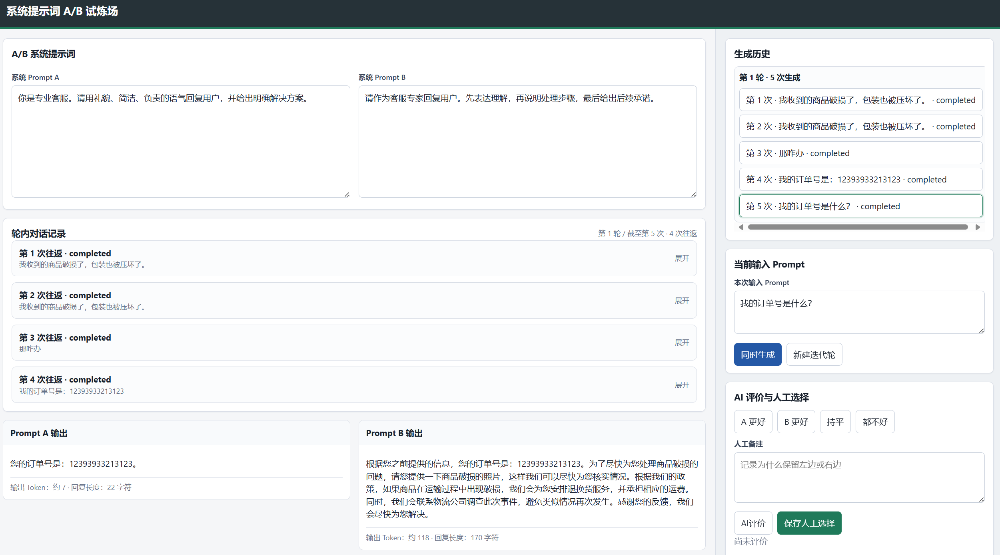

# 系统提示词 A/B 试炼场

一个本地运行的 Prompt A/B 测试工具，用于在同一用户输入下对比两套系统提示词的输出质量，并记录 AI 评价、人工选择和多轮迭代结果。



## 功能特性

- 对比两套系统提示词在同一输入 Prompt 下的模型输出
- 支持流式生成，左右两侧同步展示 Prompt A / Prompt B 的回复
- 支持同一实验下创建多个迭代轮，并保留轮内对话记录
- 内置 AI 裁判评价，输出胜出方、维度评分、总结和优化建议
- 支持人工标注选择结果和备注，便于后续复盘
- 实验数据自动保存到本地 `data/` 目录
- 支持导出实验结果为 JSON 和 Markdown
- 兼容 OpenAI API 以及 OpenAI-compatible 服务

## 技术栈

- Python 3.10+
- FastAPI
- Uvicorn
- OpenAI Python SDK
- python-dotenv
- 原生 HTML / CSS / JavaScript

## 项目结构

```text
.
├── main.py                  # FastAPI 后端入口
├── static/
│   └── index.html           # 前端页面
├── imgs/
│   └── demo.png             # README 截图
├── pyproject.toml           # 项目依赖配置
├── uv.lock                  # uv 锁定文件
└── data/                    # 本地实验数据，默认不提交到 Git
```

## 快速开始

### 1. 克隆项目

```bash
git clone https://github.com/whitejoce/prompt_test.git
cd prompt_test
```

### 2. 安装依赖

推荐使用 `uv`：

```bash
uv sync
```

如果没有使用 `uv`，也可以手动安装依赖：

```bash
pip install fastapi "uvicorn[standard]" openai python-dotenv
```

### 3. 配置环境变量

在项目根目录创建 `.env` 文件：

```env
OPENAI_API_KEY=your_api_key_here
OPENAI_BASE_URL=https://api.openai.com/v1
OPENAI_MODEL=gpt-5.5
```

说明：

- `OPENAI_API_KEY`：必填，模型服务 API Key
- `OPENAI_BASE_URL`：可选，默认使用 OpenAI 官方接口，也可以填写兼容 OpenAI 协议的服务地址
- `OPENAI_MODEL`：可选，默认模型名称，可在页面中按实验覆盖

### 4. 启动服务

```bash
uv run uvicorn main:app --reload
```

或使用已安装的 Python 环境：

```bash
uvicorn main:app --reload
```

启动后访问：

```text
http://127.0.0.1:8000
```

## 使用流程

1. 在「实验配置」中填写实验名称、实验目标、模型和生成参数。
2. 在「A/B 系统提示词」中分别填写 Prompt A 和 Prompt B。
3. 在「当前输入 Prompt」中填写用户输入，点击「同时生成」。
4. 查看左右两侧输出，并点击「AI评价」生成裁判结果。
5. 根据实际判断选择「A 更好」「B 更好」「持平」或「都不好」，并保存人工备注。
6. 需要继续迭代时点击「新建迭代轮」，或继续在当前轮内生成更多记录。
7. 使用「导出 JSON」或「导出 Markdown」保存实验报告。

## 数据存储

实验数据会按实验名称和时间戳保存到本地目录：

```text
data/<实验名称>-<时间戳>/experiments.json
```

`data/` 目录用于保存本地实验记录，通常不建议提交到公开仓库。`.env` 文件包含密钥，也不应提交。

## API 概览

| 方法 | 路径 | 说明 |
| --- | --- | --- |
| `GET` | `/` | 前端页面 |
| `GET` | `/api/config` | 获取默认模型配置 |
| `GET` | `/api/experiments` | 获取实验列表 |
| `GET` | `/api/experiments/{experiment_id}` | 获取实验详情 |
| `POST` | `/api/experiments` | 新建或更新实验 |
| `POST` | `/api/rounds` | 新建迭代轮 |
| `POST` | `/api/generate/stream` | 流式生成 A/B 输出 |
| `POST` | `/api/runs/{run_id}/evaluate` | 对单次生成结果进行 AI 评价 |
| `PATCH` | `/api/runs/{run_id}` | 保存人工选择和备注 |
| `GET` | `/api/export/{experiment_id}.json` | 导出 JSON |
| `GET` | `/api/export/{experiment_id}.md` | 导出 Markdown |
